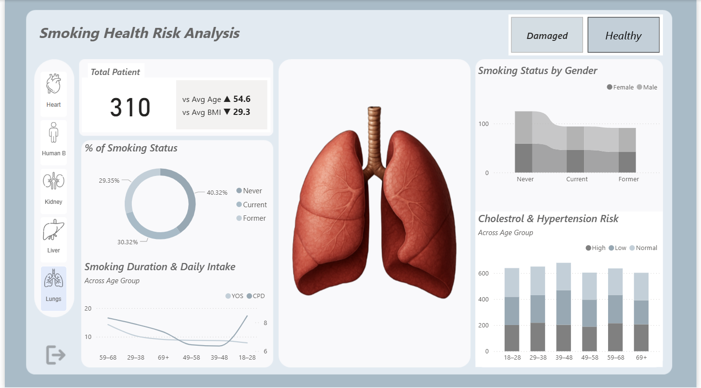
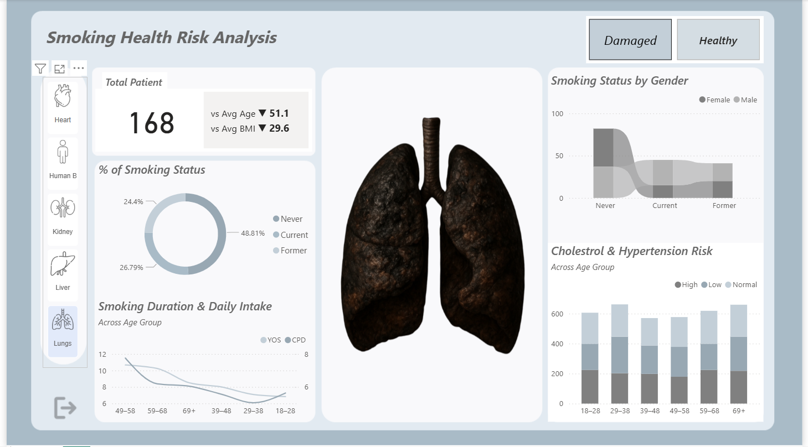
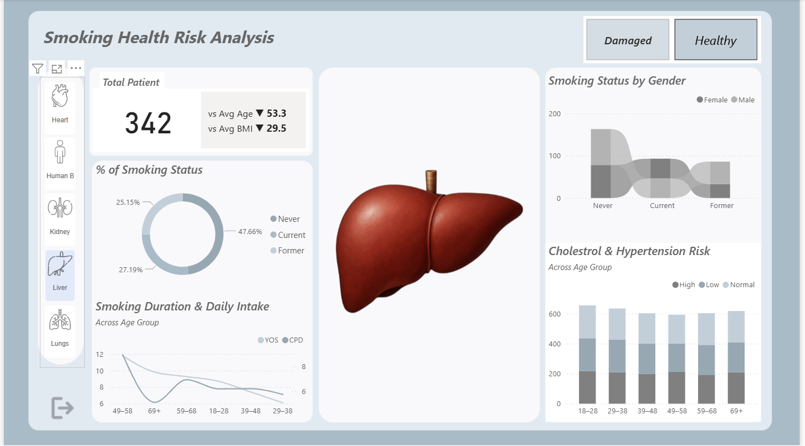
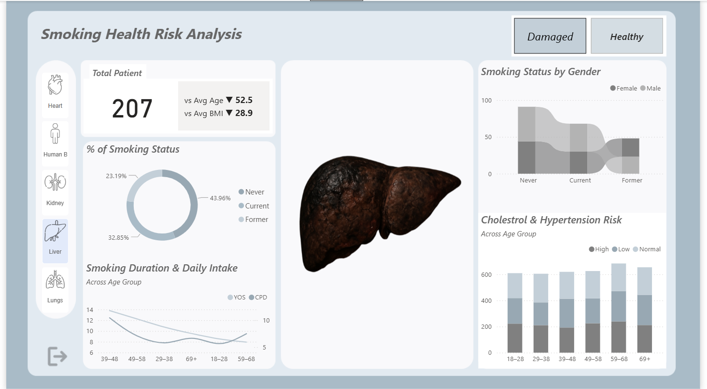
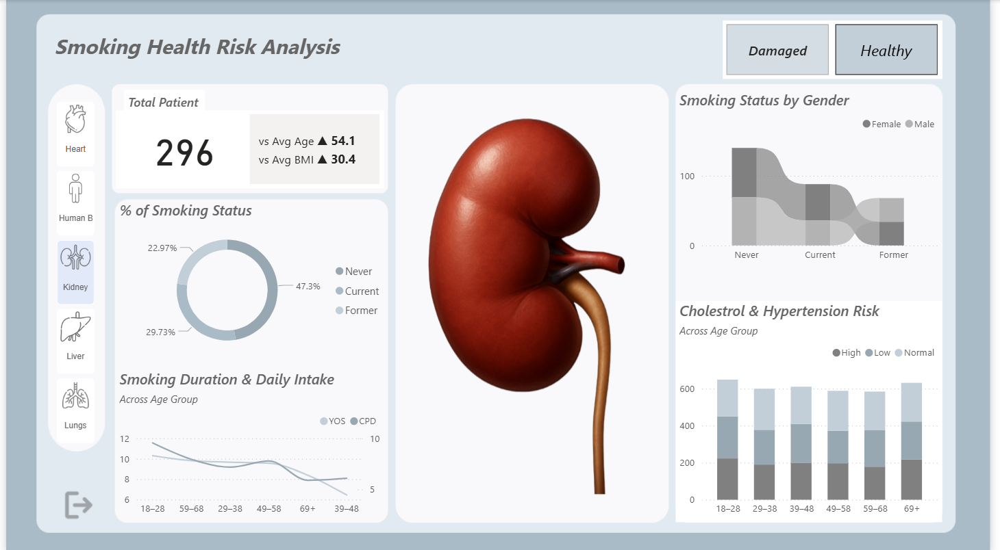
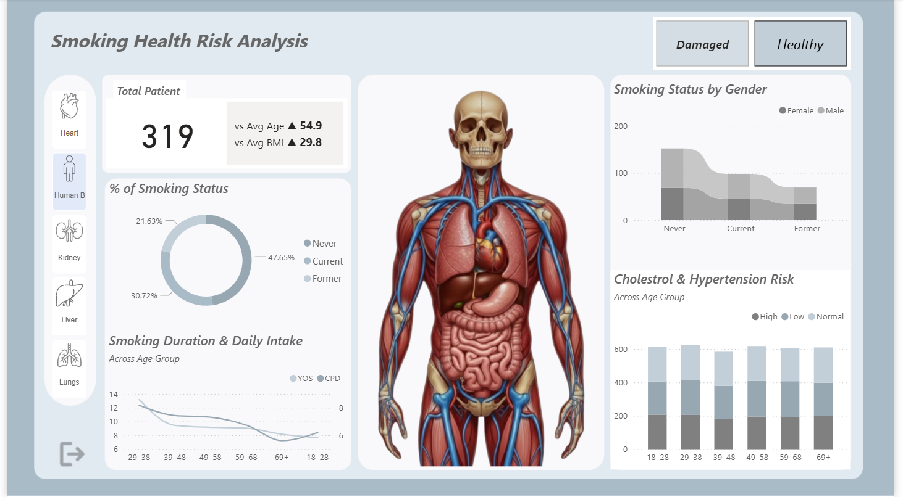
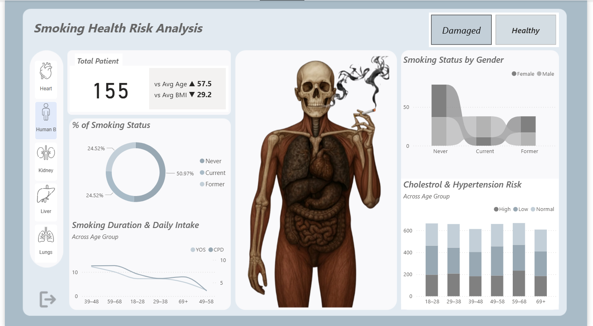
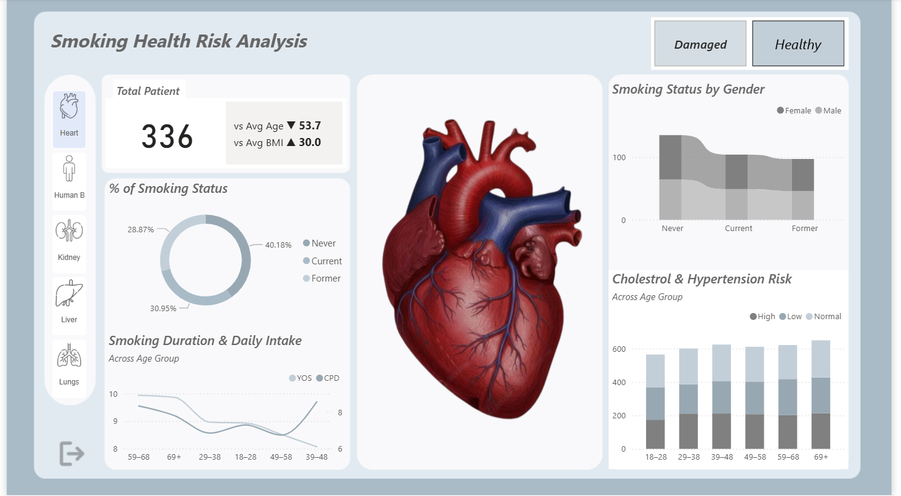
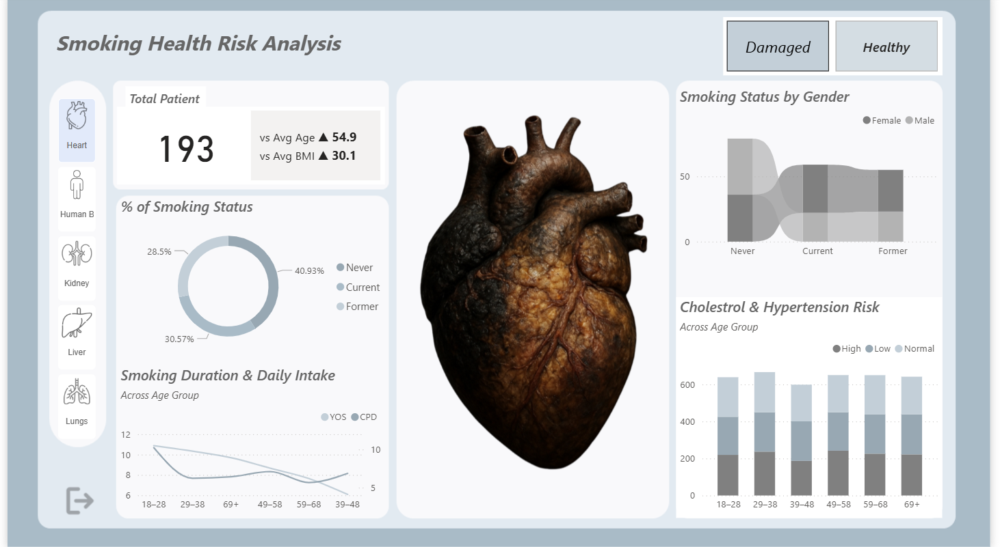

# 🚬 Smoking Health Risk Analysis (Power BI)

This project presents an **interactive Power BI dashboard** that analyzes the **health risks associated with smoking**.
It highlights how smoking status impacts **different organs, age groups and health conditions** such as cholesterol and hypertension.

The dashboard allows users to **compare Healthy vs Damaged conditions** and observe changes across multiple health indicators.

---

## 📊 Key Objectives

* Analyze smoking patterns across different age groups
* Compare **Never, Current and Former smokers**
* Visualize health risks related to:

  * Heart
  * Lungs
  * Liver
  * Kidney
  * Overall Human Body
* Enable **Healthy vs Damaged** comparison using interactive buttons

---

## 🧠 Dashboard Features

* **Total Patient Count** with comparison to **average age and BMI**
* **Smoking Status Distribution** using a **Donut Chart**
* **Smoking Status by Gender** to highlight behavioral differences
* **Smoking Duration & Daily Intake** analysis across **different age groups**
* **Cholesterol & Hypertension Risk Analysis** by age category
* **Organ-based visual indicators** showing **Healthy vs Damaged** conditions

---

## 🖼️ Dashboard Screenshots

### 🔹 Healthy – Lungs View



### 🔹 Damaged – Lungs View



---

### 🔹 Healthy – Liver View



### 🔹 Damaged – Liver View



---

### 🔹 Healthy – Kidney View



### 🔹 Damaged – Kidney View


---

### 🔹 Healthy – Human Body Overview



### 🔹 Damaged – Human Body Overview



---

### 🔹 Healthy – Heart View



### 🔹 Damaged – Heart View



---

## 🛠 Tools & Technologies

* **Power BI Desktop**
* **DAX** (for calculated measures)
* **Power Query** (data cleaning & transformation)
* **Data Visualization & Dashboard Design**

---

## 📁 Project Structure

```
Smoking-Health-Risk-Analysis/
│
├── Dataset/                          # Dataset used for analysis
│   └── smoking_health_data.csv      # Patient smoking & health records
│
├── images/                           # Dashboard screenshots (used in README)
│   ├── healthy_lungs.png
│   ├── damaged_lungs.png
│   ├── heart_analysis.png
│   ├── kidney_analysis.png
│   └── liver_analysis.png
│
├── Background Viz.png                # Custom background design used in Power BI
│
├── Smoking_Health_Risk_Analysis.pbit # Power BI template file
│
└── README.md                         # Project documentation

```

---

## 📈 Insights

* Current smokers show **higher health risk indicators**
* Risk levels increase significantly with age
* Former smokers perform better than current smokers but worse than never smokers
* Organ damage correlates strongly with smoking duration

---

## 👩‍💻 Author

**Abirah Zaidi**
